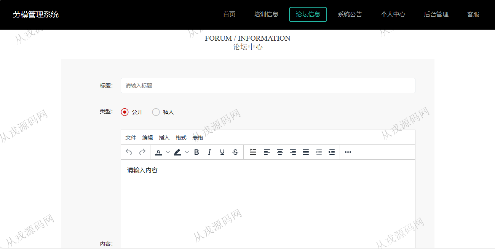

<h1 align="center">132.劳模管理系统</h1>

- <b>完整代码获取地址：从戎源码网 ([https://armycodes.com/](https://armycodes.com/))</b>
- <b>技术探讨、资料分享，请加QQ群：692619798</b> 
- <b>作者微信：19941326836  QQ：952045282</b> 
- <b>承接计算机毕业设计、Java毕业设计、Python毕业设计、深度学习、机器学习</b>
- <b>选题+开题报告+任务书+程序定制+安装调试+论文+答辩ppt 一条龙服务</b>
- <b>所有选题地址 ([https://github.com/YuLin-Coder/AllProjectCatalog](https://github.com/YuLin-Coder/AllProjectCatalog)) </b>

## 项目介绍
基于springboot+vue的劳模管理系统：前端 vue、elementui，后端 maven、springmvc、spring、mybatis；角色分为管理员、劳模；集成劳模管理、档案变动、奖惩信息功能于一体的系统。

## 功能介绍

### 劳模

- 基本功能：登录、注册、退出
- 网站首页：主导航栏，轮播图，全局搜索，系统公告展示、培训信息展示
- 培训信息：培训信息详情，收藏，评论，在线报名
- 论坛信息：论坛信息列表展示，发布新帖
- 系统公告：公告信息展示，公告详情
- 个人中心：个人信息查看与修改，我的发布信息，我的收藏列表

### 管理员

- 个人中心：个人信息查看与修改，密码修改
- 个人档案管理：档案信息列表查询，新增档案，详情查看，变动申请
- 档案变动管理：档案变动列表查询，审核状态查看，信息删除
- 奖惩信息管理：奖惩信息列表查询，关键词搜索
- 培训报名管理：前台用户在线报名提交后，后台管理员查看报名信息，对用户的报名信息进行审核
- 课程信息：课程信息的列表查询

## 环境

- <b>IntelliJ IDEA 2021.3</b>

- <b>Mysql 5.7.26</b>

- <b>node 14.14.0</b>

- <b>JDK 1.8</b>

## 运行截图

